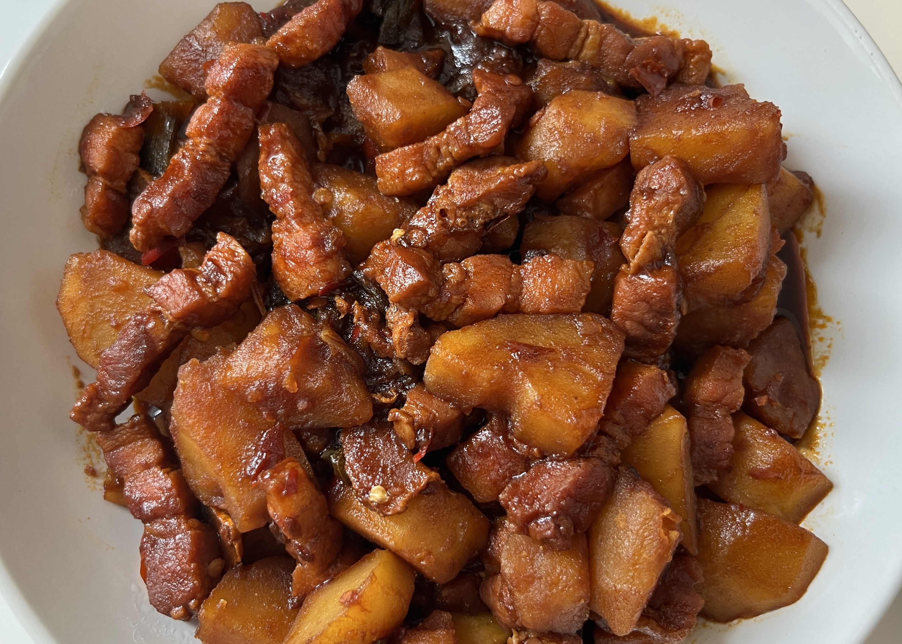
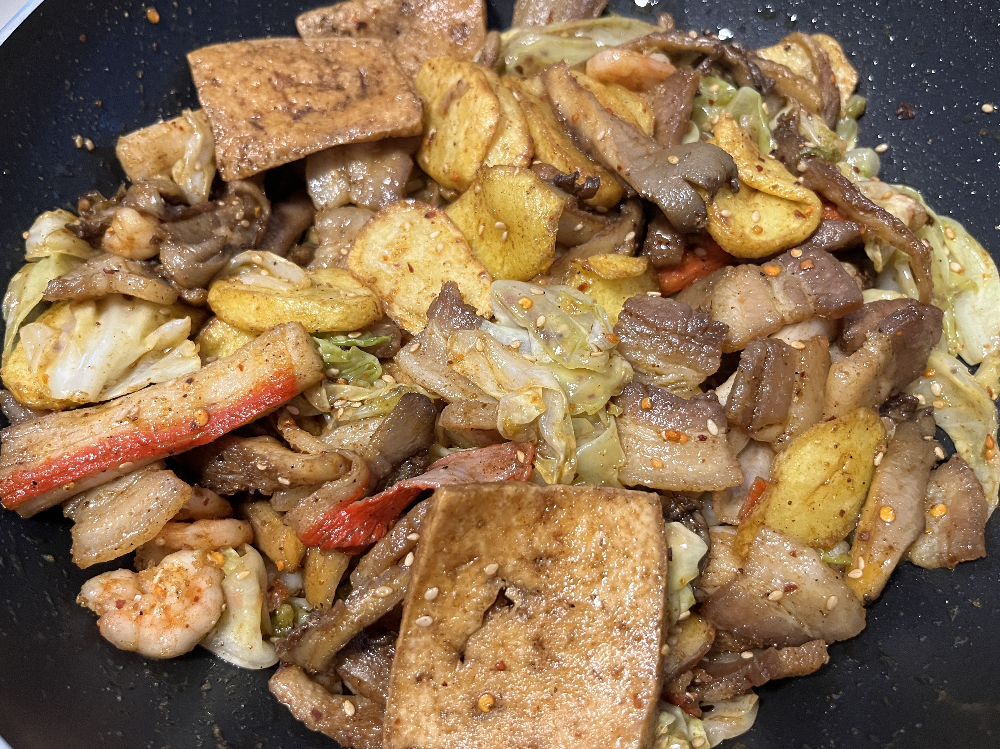
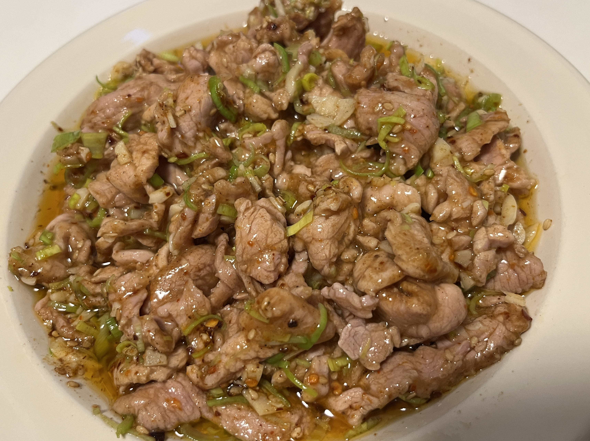
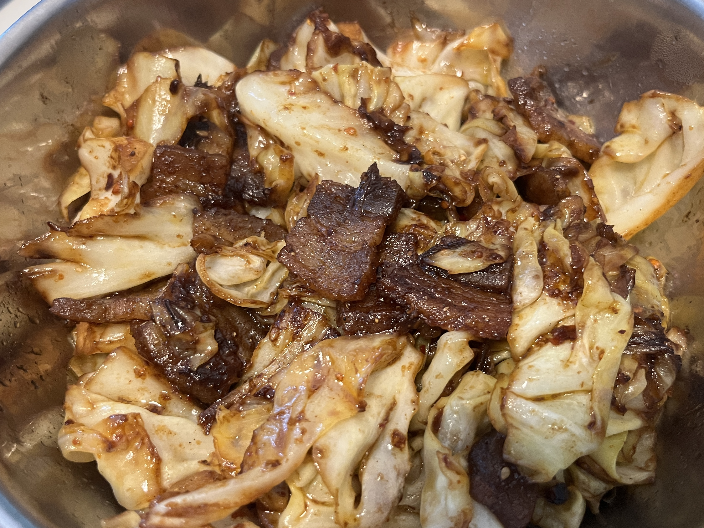

## 一口吃不出个大胖子
记录下平时都吃了些什么东西，以确定长的每一斤肉都是俺们的光辉战绩(´ｰ∀ｰ`)
主要是正餐的饭菜，无零食水果（除非它实在是太好吃或很特别？让我忍不住想要拿来分享）

那，我们就开始吧！滴滴滴，流量警告 •﹏•

---

注：因本人缺乏常识（大概...吧），导致大量图片丢失。本记录于2025年10月17日重写（看起来很平静实际上已经崩溃了...

---

   
  
刚做出来的炒粉丝干香干香的，但隔天再热了吃就...
 
   
  
吃不到豌杂面那就做一碗鹰杂面吧（用了鹰嘴豆来代替）
 
   
  
五花肉烧土豆，生抽放得有点多了...咸
 
   
  
吃不到烧烤怎么办？自己做阿！（然后牙龈立刻发炎了...哭）
 
   
  
孜然土豆片里的洋葱绝对是点睛之笔
 
   
  
凉拌土豆丝，口感爽脆很适合没什么胃口的夏天
 
   
  
随手炒了盘嫩牛肉，甜椒是败笔
 
   
  
葱烧大排？呃 再次挑战失败
 
   
  
食堂的三明治配咖喱汤其实还不错吃
 
   
  
一锅乱烩 味道不错 但是豆腐完全没味道？？
 
   
  
用土豆淀粉抓肉就会变很嫩！然后加上蒜泥搅拌搅拌...
 
   
  
五花肉的腥味很重 但是包菜酸酸的很不错！
 
   
  
有谁能拒绝一碗蒸蛋呢
 
   
  
简简单单一碗炒饭这样子
 

