# Misc 杂项
> 点击**蓝色字体**标题，可跳转至该章节的TailwindCSS4官方文档查看详情。
> 或，到我的[仓库](https://github.com/own-place/self-study-and-uni-courses/tree/main/00_Self_Study/tailwindcss4-notes)看代码（注：超混乱，最好还是去看官方文档跟问gpt...

## [边框圆角](https://tailwindcss.com/docs/border-radius)
- 四个角一起设置：rounded-xs / sm / md / lg / xl / 2xl / 3xl / none / full  
- 单独设置两个角：rounded-t-lg (上边两个角)，中间参数可替换成 r, b, l  
- 单独设置一个角：rounded-tl-lg (左上角)，中间参数可替换成 tr, bl, br  
- 可自定义：rounded-[value]
```html
<p class="rounded-xl w-[150px] h-[55px] bg-blue-300 text-center text-white text-xl mt-2">rounded-xl</p>
```
    
  
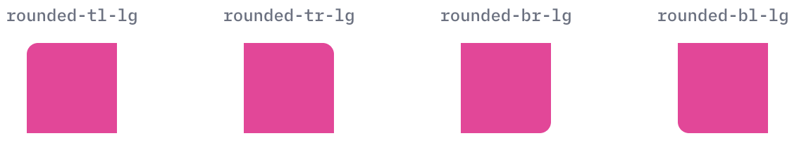

## 边框与描边
边框的[厚度](https://tailwindcss.com/docs/border-width)、[颜色](https://tailwindcss.com/docs/border-color)、[样式](https://tailwindcss.com/docs/border-style)都可设置，还可单独设置某一边  
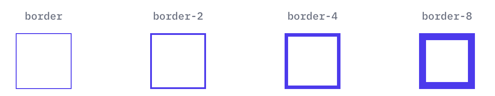  
  
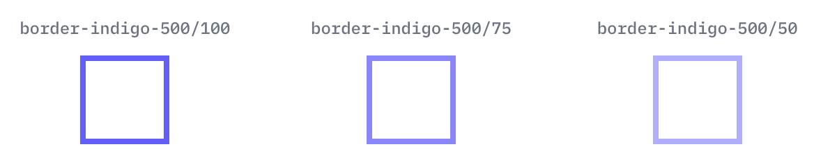  
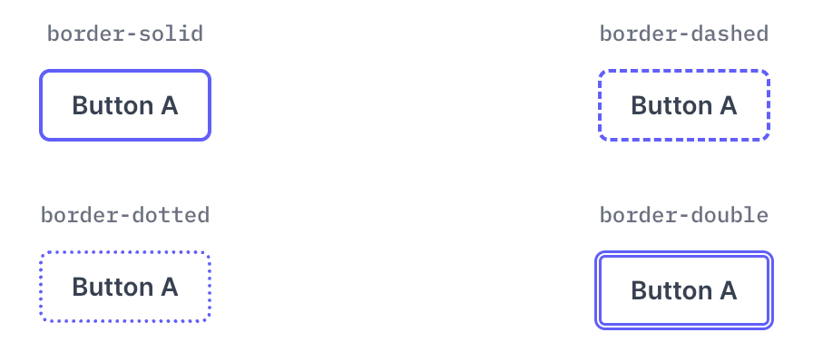

边框外边有一条描边，也可分别设置 [宽度](https://tailwindcss.com/docs/outline-width)、[颜色](https://tailwindcss.com/docs/outline-color)、[样式](https://tailwindcss.com/docs/outline-style)、[偏移](https://tailwindcss.com/docs/outline-offset)  
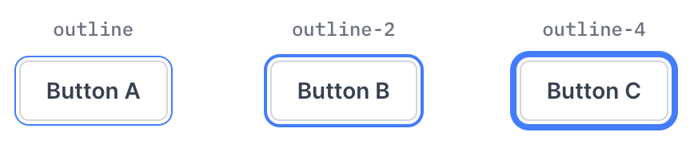  
  
  


## [可见性控制](https://tailwindcss.com/docs/visibility)
visible 显示元素，invisible 隐藏元素但仍占位。 
```html
<div class="flex space-x-4 mt-2">
    <div class="bg-red-300 w-20 h-20 visible flex items-center justify-center">Visible</div>
    <div class="bg-blue-300 w-20 h-20 invisible flex items-center justify-center">Invisible</div>
    <div class="bg-red-300 w-20 h-20 visible flex items-center justify-center">Visible</div>
</div>
```
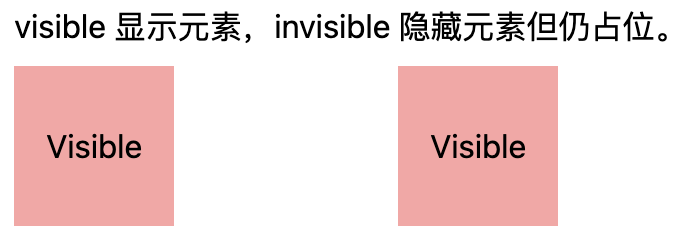

## [z-index](https://tailwindcss.com/docs/z-index)
通过 z-index 控制元素堆叠顺序，数值越大越在上面。  
```html
<div class="relative w-40 h-40 bg-gray-200 mt-2">
    <div class="absolute top-0 left-0 w-20 h-20 bg-red-500 z-10">z-10</div>
    <div class="absolute top-4 left-4 w-20 h-20 bg-blue-500 z-20">z-20</div>
</div>
```
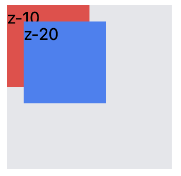

## [阴影效果](https://tailwindcss.com/docs/box-shadow)
控制元素的盒子阴影，可增加立体感。  
```html
<div class="flex space-x-4 mt-2">
    <div class="w-24 h-24 bg-red-300 flex items-center justify-center">无</div>
    <div class="w-24 h-24 bg-blue-300 shadow-2xl flex items-center justify-center">2xl</div>
</div>
```
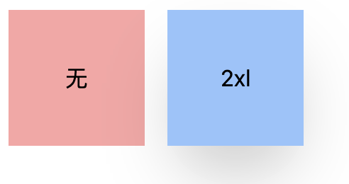

## [禁用状态透明度](https://tailwindcss.com/docs/opacity)
禁用状态时降低透明度，例如按钮或表单。  
```html
<div class="mt-2 flex space-x-4">
    <button class="bg-red-500 text-white px-4 py-2">Enabled</button>
    <button disabled class="bg-red-500 text-white px-4 py-2 disabled:opacity-20">Disabled</button>
</div>
```


## [遮罩效果](https://tailwindcss.com/docs/mask-clip)
mask-* 系列可以控制元素可见区域，可实现渐变、形状遮罩等效果，可应用于图片或背景，制作复杂的视觉效果。

## [表格边框折叠](https://tailwindcss.com/docs/border-collapse)
collapse 折叠边框  
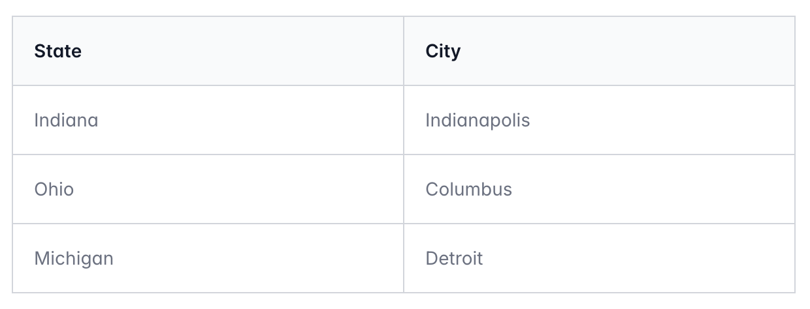

separate 保留边框间距  
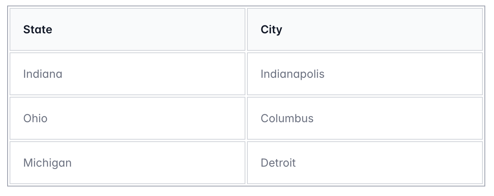

## [表格边距](https://tailwindcss.com/docs/border-spacing)
border-spacing-* 用于设置单元格之间的间距。 
```html
<table class="border border-gray-400 border-separate border-spacing-4 mt-2">
    <tr>
        <td class="border px-2 py-1">A</td>
        <td class="border px-2 py-1">B</td>
    </tr>
    <tr>
        <td class="border px-2 py-1">C</td>
        <td class="border px-2 py-1">D</td>
    </tr>
</table>
```
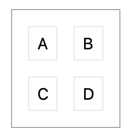

## [表格布局模式](https://tailwindcss.com/docs/table-layout)
table-auto 根据内容自动调整列宽 
```html
<table class="table-auto border border-gray-400 mt-2">
    <tr>
        <td class="border px-2 py-1">内容多</td>
        <td class="border px-2 py-1">短</td>
    </tr>
</table>
```
table-fixed 固定列宽  
```html
<table class="table-fixed border border-gray-400 mt-2 w-64">
    <tr>
        <td class="border px-2 py-1">内容多</td>
        <td class="border px-2 py-1">短</td>
    </tr>
</table>
```
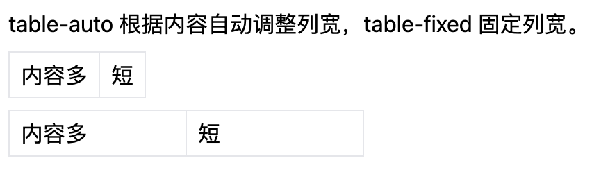

## [表格标题位置](https://tailwindcss.com/docs/caption-side)
控制 caption 在表格上方(caption-top)或下方(caption-bottom)显示。  
```html
<table>
  <caption class="caption-top">
    Table 3.1: Professional wrestlers and their signature moves.
  </caption>
  <thead>
    <tr>
      <th>Wrestler</th>
      <th>Signature Move(s)</th>
    </tr>
  </thead>
  <tbody>
    <tr>
      <td>"Stone Cold" Steve Austin</td>
      <td>Stone Cold Stunner, Lou Thesz Press</td>
    </tr>
    <tr>
      <td>Bret "The Hitman" Hart</td>
      <td>The Sharpshooter</td>
    </tr>
    <tr>
      <td>Razor Ramon</td>
      <td>Razor's Edge, Fallaway Slam</td>
    </tr>
  </tbody>
</table>
```


## [过渡效果](https://tailwindcss.com/docs/transition-property)
transition-* 系列用于控制属性过渡动画，例如颜色、位置、尺寸变化等。

## [动画效果](https://tailwindcss.com/docs/animation)
animation-* 系列可定义动画，如处理、呼吸、置顶、弹跳等。

## [元素旋转](https://tailwindcss.com/docs/rotate)
rotate-* 用于旋转元素，例如 rotate-45 旋转 45 度，负值可逆向旋转。  
```html
<div class="flex space-x-6 mt-2">
    <div class="w-20 h-20 bg-red-300 flex items-center justify-center rotate-45">45°</div>
    <div class="w-20 h-20 bg-blue-300 flex items-center justify-center -rotate-12">-12°</div>
    <div class="w-20 h-20 bg-green-300 flex items-center justify-center rotate-90">90°</div>
</div>
```
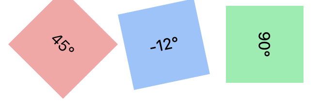

## [输入光标颜色](https://tailwindcss.com/docs/caret-color)
用于改变文本输入框或可编辑内容的光标颜色。 
```html
<input class="caret-red-500 border border-gray-400 px-2 py-1 mt-2" placeholder="输入试试">
```
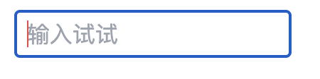

## [常用鼠标样式](https://tailwindcss.com/docs/cursor)
常见 cursor-*：pointer, not-allowed, move, text, wait, crosshair, grab, grabbing。  
```html
<div class="bg-red-300 w-24 h-24 cursor-not-allowed flex items-center justify-center">pointer</div>
```
