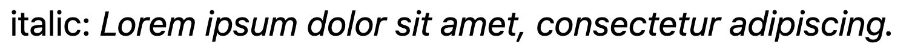
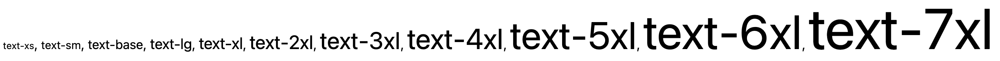
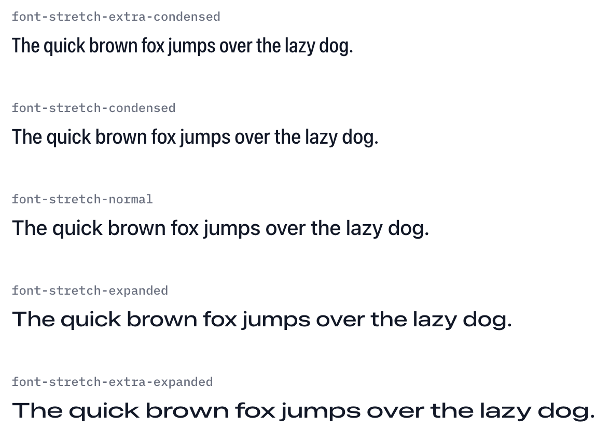
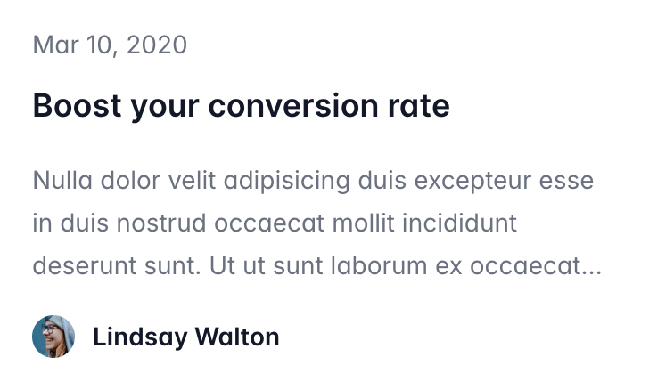
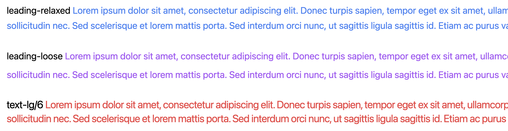
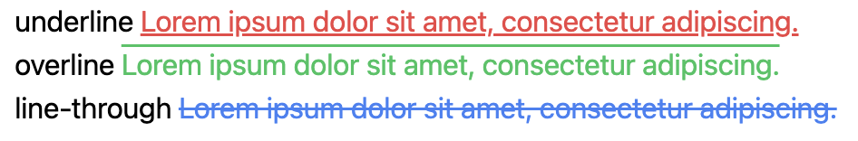
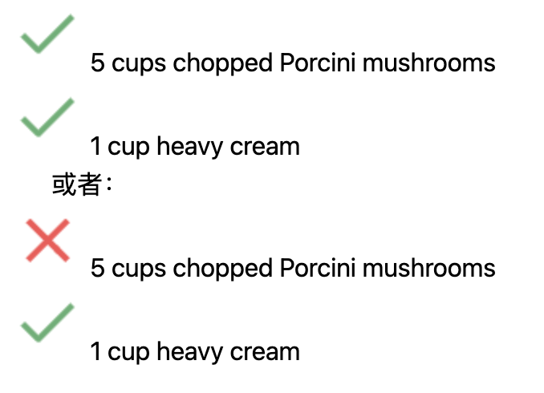

# Typography 版式
> 点击**蓝色字体**标题，可跳转至该章节的TailwindCSS4官方文档查看详情。
> 或，到我的[仓库](https://github.com/own-place/self-study-and-uni-courses/tree/main/00_Self_Study/tailwindcss4-notes)看代码（注：超混乱，最好还是去看官方文档跟问gpt...

## [字体](https://tailwindcss.com/docs/font-family)


```html
<span class="font-sans">font-sans</span>
```


## [风格](https://tailwindcss.com/docs/font-style) 
```html
<span class="italic">Lorem ipsum dolor sit amet, consectetur adipiscing.</span>
```


## [字重](https://tailwindcss.com/docs/font-weight)
```html
<span class="font-thin">font-thin</span>
``` 


## [字号](https://tailwindcss.com/docs/font-size) 
text-xs, text-sm, text-base, text-lg, text-xl, text-2xl ... text-9xl
```html
<span class="text-xs">text-xs</span>
```


## [字体压扁](https://tailwindcss.com/docs/font-stretch) 


## [数字显示效果](https://tailwindcss.com/docs/font-variant-numeric) 

## [大段字符以定义的行数显示](https://tailwindcss.com/docs/line-clamp)
展示不完的将显示省略号，可用来做预览卡片 
```html
<p class="line-clamp-3">
    Nulla dolor velit adipisicing duis excepteur esse in duis nostrud occaecat mollit incididunt deserunt sunt. Ut ut
    sunt laborum ex occaecat eu tempor labore enim adipisicing minim ad. Est in quis eu dolore occaecat excepteur fugiat
    dolore nisi aliqua fugiat enim ut cillum. Labore enim duis nostrud eu. Est ut eiusmod consequat irure quis deserunt
    ex. Enim laboris dolor magna pariatur. Dolor et ad sint voluptate sunt elit mollit officia ad enim sit consectetur
    enim.
 </p>
```
 

## [字间距](https://tailwindcss.com/docs/letter-spacing)
```html
<p class="tracking-tighter">tracking-tighter  <span class="text-red-500">Lorem ipsum dolor sit amet, consectetur adipiscing.</span></p>
```


## [行高](https://tailwindcss.com/docs/line-height)
可用 `leading-xxx` 设置，也可用 `text-lg/6` 形式将字号与行高一起设置 
```html
<p class="leading-none">leading-none  <span class="text-red-500">Lorem ipsum dolor sit amet, consectetur adipiscing elit. Donec turpis sapien, tempor eget ex sit amet, ullamcorper cursus nisl.</span></p>
``` 


## [文本对齐](https://tailwindcss.com/docs/text-align)
一般情况下，left和start视觉效果相同，right和end视觉效果相同。  
start根据语言方向决定对齐方式（如希伯来语是从右向左书写，那么此时start将会是靠右对齐），left则始终把文本靠左对齐。  
如果项目后期要扩展语言，选择使用start和end就可以不用额外写 RTL 覆盖样式了。 
```html
<p class="text-left">text-left  <span class="text-red-500">Lorem ipsum dolor sit amet, consectetur adipiscing elit. Curabitur vehicula tincidunt nibh in ultrices.</span></p>
```


## [文本颜色](https://tailwindcss.com/docs/color)
格式是 text-颜色-数值，例如 text-red-500。数值范围是100到900（还有50和950），数值越大颜色越深。还可用 text-blue-600/100 调整透明度。


## [文本装饰](https://tailwindcss.com/docs/text-decoration-line)
除了 underline 这种基础的装饰，还可以设置文本底线的颜色、距离、风格等。  
- underline, overline, line-through: `<span class="line-through text-blue-500">Lorem ipsum dolor sit amet, consectetur adipiscing.</span>`
- 悬浮显示底线: no-underline hover:underline: `<p>Lorem ipsum dolor <a class="no-underline hover:underline text-orange-500" href="#">sit amet</a>, consectetur adipiscing.</p`
- 调整底线颜色和透明度: underline decoration-blue-500/100: `<p>Lorem ipsum dolor <a class="underline decoration-blue-500/100" href="#">sit amet</a>, consectetur adipiscing.</p>`
- [底线样式](https://tailwindcss.com/docs/text-decoration-style): decoration-solid, decoration-double, decoration-dotted, de,coration-dashed, decoration-wavy -> `<span class="underline decoration-dotted">Lorem ipsum dolor sit amet, consectetur adipiscing.</span>`
- [底线粗细](https://tailwindcss.com/docs/text-decoration-thickness): decoration-1, decoration-[0.45rem] -> `<span class="underline decoration-[0.45rem]">Lorem ipsum dolor sit amet, consectetur adipiscing.</span>`
- [底线与文字的距离](https://tailwindcss.com/docs/text-underline-offset): underline-offset-1, underline-offset-[3px] -> `<span class="underline underline-offset-[3px]">Lorem ipsum dolor sit amet, consectetur adipiscing.</span>`




## [文本转换](https://tailwindcss.com/docs/text-transform)
```html
<p>uppercase: <span class="uppercase">Lorem ipsum dolor sit amet, consectetur adipiscing.</span></p>
```

## 列表
### [列表图片](https://tailwindcss.com/docs/list-style-image)
```html
<ul class="pl-6 list-image-[url('./img/check.png')]">
    <li>5 cups chopped Porcini mushrooms</li>
    <li>1 cup heavy cream</li>
</ul>
<p>或者：</p>
<ul class="pl-6">
    <li class="list-image-[url('./img/x.png')]">5 cups chopped Porcini mushrooms</li>
    <li class="list-image-[url('./img/check.png')]">1 cup heavy cream</li>
</ul>
```


### [列表位置](https://tailwindcss.com/docs/list-style-position)
- 内部：list-disc list-inside  
- 外部：list-disc list-outside  
```html
<ul class="list-disc list-outside">
    <li>5 cups chopped Porcini mushrooms</li>
    <li>1 cup heavy cream</li>
    <li>Salt and pepper to taste</li>
</ul>      
```


### [列表风格](https://tailwindcss.com/docs/list-style-type)
- 子弹列表: list-disc  
- 有序列表: list-decimal  
- 无序列表: list-none  
```html
<ul class="list-decimal">
    <li>5 cups chopped Porcini mushrooms</li>
    <li>1 cup heavy cream</li>
    <li>Salt and pepper to taste</li>
</ul>
```
